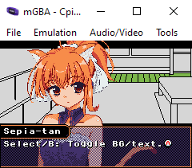

# GBA NVL engine - SepiaNVL
A basic NVL engine for making Visual Novels, Sound Novels, etc... for the Gameboy Advance.
Requires minimal coding knowledge!
Made for an article in [C-pia! Magazine](https://c-pia.github.io/).

## Script Converter

`convert_txt_to_dialogue.py` is a python script that can take a plain text script and turn it into generic dialogue code.

The output file will automatically insert a linebreak whenever the text surpasses a specified character limit (27 by default), breaking before the word that passes the character limit. Incidentally, this can help you to quickly identify lines that are too large for your textbox.

The value of when linebreaks will be inserted can be changed by editing `convert_txt_to_dialogue.py` in a text editor, as can the name of the input file (`input.txt` by default) and the output file (`output.txt` by default).

Though this won't insert intricate things such as image choices, fades, sound effects, etc... it will drastically speed up the process of converting written prose into useable code.

For example, a text file containing:

  A "bcde."
  F "ghijk."
  "lmnop."
  Q "rstu."

Would be automatically converted into:

  if(true)
  {
    bn::string_view dialogue_text_lines[] = {
        "A",
        "bcde.",
        "",
        "",
        };
    texter::dialogue(dialogue_text_lines, bgpos, dialogue_layout, bgimg, textbox, internal_window, external_window, text_generator);
    bn::core::update();
  }
  if(true)
  {
    bn::string_view dialogue_text_lines[] = {
        "F",
        "ghijk.",
        "",
        "",
        };
    texter::dialogue(dialogue_text_lines, bgpos, dialogue_layout, bgimg, textbox, internal_window, external_window, text_generator);
    bn::core::update();
  }
  if(true)
  {
    bn::string_view dialogue_text_lines[] = {
        "",
        "lmnop.",
        "",
        "",
        };
    texter::dialogue(dialogue_text_lines, bgpos, dialogue_layout, bgimg, textbox, internal_window, external_window, text_generator);
    bn::core::update();
  }
  if(true)
  {
    bn::string_view dialogue_text_lines[] = {
        "Q",
        "rstu.",
        "",
        "",
        };
    texter::dialogue(dialogue_text_lines, bgpos, dialogue_layout, bgimg, textbox, internal_window, external_window, text_generator);
    bn::core::update();
  }
